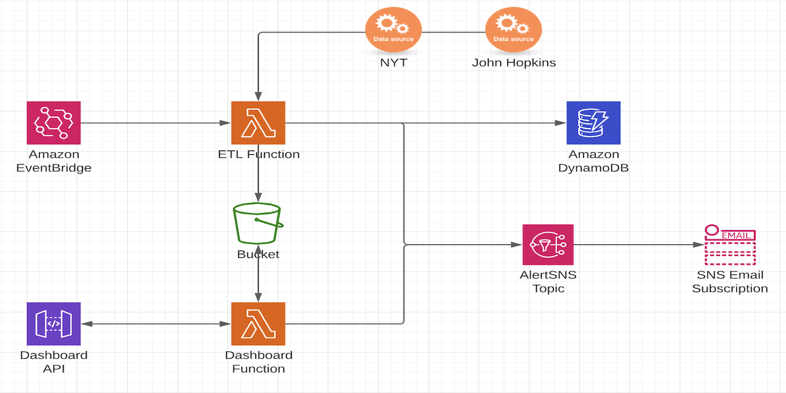

# EventDrivenPython

## Overview
Runs an ETL job on two data sources ([NYT](https://github.com/nytimes/covid-19-data/blob/master/us.csv?opt_id=oeu1600284808955r0.2700974837928787), [John Hopkins](https://raw.githubusercontent.com/datasets/covid-19/master/data/time-series-19-covid-combined.csv?opt_id=oeu1600284808955r0.2700974837928787)) and displays the data on a [dashboard](https://app.redash.io/logan-toler/public/dashboards/bQv4OpTwd8oZ2NHjT31gtjtIFiDayXu1XPK0NbTM).



### ETL Function
- Performs an ETL job within memory on a single Lambda function and the resulting data is loaded into DynamoDB and saved as a CSV in S3.
- Triggered each day at 16h00 EST using an EventBridge event.
- When loading the data into the table, a conditional expression is used to block updating/overwriting existing records and only write new ones. If a record fails to write, it will be noted and included when the job runs again.
- This function relies on Pandas to perform the job.

### Dashboard Function
- Creates data that could be used to build a dashboard. 
- This function relies on Matplot to create a stack area chart and Pandas to extract the most recent total cases, recoveries, and deaths.
- Triggered by calling the API created in the template, which pulls the CSV created by the ETL function from S3. The resulting graph is stored in an S3 bucket and the totals are returned in the API response. 
- A CloudFormation template is included that provisions the necessary infrastructure (CloudFront distribution with an S3 origin) on AWS to host a dashboard.

### SNS
An SNS topic is created to alert the amount of rows added when the ETL job completes and any run-time failures.

### CI/CD
GitHub Actions is used to build and deploy the SAM package to AWS when a change is detected on the src folder or template.

### Current Dashboard
The [current dashboard](https://app.redash.io/logan-toler/public/dashboards/bQv4OpTwd8oZ2NHjT31gtjtIFiDayXu1XPK0NbTM) is hosted on Redash. I will eventually move this over to the Vue.js app that I am working on.

SaaS dashboard solutions are very expensive and there is the additional cost of running scans/queries against a DynamoDB table to obtain the data. Using other AWS database solutions would be overkill for this challenge and still carry a high operating cost. Therefore, DynamoDB was chosen and using a custom dashboard by only using the CSV stored in S3, would further reduce the cost.

### Unit Testing
The unit test directory contains two sample CSV files with a few malformed records and a Jupyter Notebook to run the tests. 

## To deploy 
### Clone the repo
```
gh repo clone tolerl1/EventDrivenPython
```
### API Configuration
```
Copy totals-openapi.yaml to an S3 bucket
Change the S3 location under API -> DefinitionBody to point towards your bucket containing the OpenApi config
```
### Push to master branch
